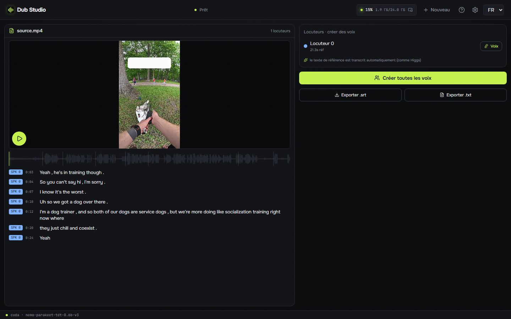

<div align="center">


# Dub Studio

**Estudio de doblaje de vídeo con IA, gratuito y sin conexión, para Windows —— redobla cualquier vídeo corto a otro idioma con voz clonada, subtítulos traducidos y localización del texto en pantalla. 100% local, cero Python: un `.exe` nativo (Rust + C++/CUDA); todos los modelos y motores se descargan con un botón.**

[](LICENSE)
[](https://github.com/timoncool/dub-studio/stargazers)
[](https://github.com/timoncool/dub-studio/releases)
[](https://github.com/timoncool/dub-studio/releases)

[English](README.md) · [Русский](README.ru.md) · [中文](README.zh.md) · **Español** · [Português](README.pt.md) · [Français](README.fr.md)

### [🌐 Demo en vivo y showcase antes/después →](https://timoncool.github.io/dub-studio/)



</div>

## Míralo en acción

**[▶ Ver el showcase antes/después en el sitio →](https://timoncool.github.io/dub-studio/#showcase)** — clips reales doblados de principio a fin en una GPU local: distintos vídeos, modos e idiomas.

|  |  |  |
|:--:|:--:|:--:|
| 🎙️ **Doblaje** · EN→RU | 🗣️ **Voz superpuesta** · EN→ES | 🎬 **Transcripción** · diarización |

## Qué es

**Dub Studio** convierte cualquier vídeo corto en una versión doblada a otro idioma —— **con el timbre del hablante clonado, subtítulos traducidos y el texto incrustado localizado sobre el propio fotograma**. Suelta un clip y un pase automático inteligente crea el primer borrador; luego un editor en vivo pone **cada subtítulo, voz, caja de desenfoque, fuente y título** bajo tu control con vista previa instantánea.

Todo se ejecuta **100% en tu equipo** —— sin nube, sin subidas, sin suscripción. Ni tu material ni tu voz salen del ordenador.

Es **v2 —— una reescritura totalmente nativa**. Sin Python embebido, sin torch, sin ruedas CUDA. Toda la canalización es **Rust + motores nativos C++/CUDA (GGUF/ONNX)**: un proceso, arranque rápido, poca VRAM. Los modelos, motores, runtime de CUDA/VC++ y ffmpeg los **descarga e instala la propia app** en el primer arranque —— el único paso manual es el controlador NVIDIA.

## Cinco modos, conmutables al vuelo

| Modo | Qué hace |
|------|----------|
| 🎙️ **Doblaje** | Redoblaje completo al idioma destino con el **timbre original clonado** —— reparto automático por hablante o voz a elección |
| 🗣️ **Voz superpuesta** | Voz traducida **sobre el original atenuado** —— el original sigue oyéndose debajo; equilibrio ajustable |
| 📝 **Subtítulos** | Subtítulos en el **idioma original**, conservando el audio original —— sin doblaje ni traducción |
| ✨ **Remix divertido** | Da un tema («como un pirata», «como un noticiero») → el modelo **reescribe todo el guion** y redobla |
| 🎬 **Transcripción** | **Transcripción diarizada** limpia con disposición por hablante, reproducción tipo karaoke, creación de voces con un clic, export `.srt`/`.txt` |

Carga un clip una vez y envíalo a cualquier modo dentro del editor.

## Funciones

- **Clonación de voz** —— el timbre original se clona y habla el nuevo idioma (motor nativo [Higgs Audio v3](https://huggingface.co/bosonai), GGUF). Reparto automático por hablante o tu propia voz de un pack.
- **Diarización de hablantes** —— quién habla y cuándo (NVIDIA **Sortformer** v2, hasta 4 voces), una voz distinta por hablante.
- **Elección de motor ASR** — transcribe con **Parakeet-TDT** (GPU, por defecto) o **Whisper** ([faster-whisper standalone de Purfview](https://github.com/Purfview/whisper-standalone-win), funciona en CPU) — elige el tamaño del modelo (tiny … large-v3-turbo) y el cuant (compute type) directamente en ajustes.
- **Pipeline componible** — interruptores independientes en la entrada: audio (original / doblaje / voz superpuesta / transcripción) × subtítulos (ninguno / original / traducidos) × grabar en el vídeo sí/no × remix humorístico. Cualquier combinación — doblaje sin subtítulos, subtítulos traducidos sin doblaje, doblaje humorístico con tus propias voces — también en lote y en el editor.
- **Localización de texto en pantalla** —— OCR detecta el texto incrustado (**PP-OCR** ONNX), **desenfoca el original** e imprime encima un título localizado con estilo a juego —— una función que ninguna otra herramienta tiene.
- **Traducción + análisis visual de estilo** —— la transcripción se traduce localmente con **Gemma-4 12B** (GGUF, llama.cpp); un pase de visión lee el diseño del fotograma: estilo de subtítulos, títulos, marcas, zonas de texto.
- **Separación vocal SOTA** —— **Mel-Band Roformer** (BSRoformer.cpp nativo en CUDA) separa la voz de la música: la pista de fondo se **conserva** y el clon se engancha a un habla limpia.
- **26 preajustes de subtítulos** —— karaoke / palabra a palabra / hormozi / neón y más, renderizados **sobre tu fotograma** (WYSIWYG, JASSUB sobre el mismo `.ass` que graba ffmpeg).
- **Transcripción karaoke** —— reproduce el vídeo y sigue cómo se iluminan la línea y la **palabra** actuales en la transcripción.
- **Editor en vivo** —— edita transcripción, voces, estilo de subtítulos, cajas de desenfoque, títulos; **vista previa ~0,17 s/fotograma**, cada cambio se ve al instante.
- **Regeneración inteligente** —— al exportar solo se resintetizan los segmentos que cambiaste, no todo el clip.
- **Procesamiento por lotes** —— cola de archivos, todos con una misma configuración, progreso por archivo.
- **Comparar antes/después** —— original y doblaje lado a lado.
- **100+ idiomas** —— dobla a cualquier idioma principal (español, chino, japonés, árabe, hindi y más), con autodetección del idioma origen.
- **Cualquier formato de vídeo** —— MP4, MOV, MKV, WEBM, AVI y más (decodificado con ffmpeg).
- **Instalación de un botón + autoactualización** —— modelos, motores, runtime CUDA/VC++ y ffmpeg se descargan en el primer arranque; la app se actualiza sola.
- **Descargas reanudables** —— los modelos grandes (10 GB+) se reanudan desde donde se cortaron tras una caída de conexión, en vez de reiniciar.
- **Ajusta a tu hardware** —— cada motor trae varias cuantizaciones (TTS Q8/Q6/Q4, traducción Q4…Q8, ASR int8/fp32 o Whisper tiny…large-v3-turbo, separación Q8/Q5/Q4) — cámbialas en ajustes; limita el lote de prefill y la duración de la referencia para GPU de 8–12 GB y 32 GB de RAM.
- **Totalmente portátil** —— nada se escribe en tu perfil de usuario; borra la carpeta y no queda rastro.

## Capturas

Pantalla principal —— cinco modos, vista previa del vídeo elegido, selección de idioma, cualquier formato:


Modo transcripción —— transcripción diarizada con disposición por hablante, karaoke y creación de voces desde cada hablante con un clic:


## Requisitos

- **SO:** Windows 10 / 11 (x64)
- **GPU:** NVIDIA con 8–16 GB de VRAM
- **WebView2** —— preinstalado en Windows 11 (se instala solo en Windows 10)
- **Disco:** ~15 GB para modelos, motores y runtime (se descargan en el primer arranque), más espacio para tus proyectos

Lo único que instalas a mano es un **[controlador NVIDIA](https://www.nvidia.com/Download/index.aspx)** reciente. Todo lo demás lo descarga la app con un botón en el primer arranque.

## Inicio rápido

1. **Descarga** la versión portátil desde [Releases](https://github.com/timoncool/dub-studio/releases) y descomprime donde quieras (o instala con `-setup.exe` / `.msi`).
2. **Ejecuta** `Dub Studio.exe`.
3. En el panel de **primer arranque** pulsa **Descargar todo** —— la app obtiene modelos, motores y runtime (~15 GB, una vez).
4. **Suelta un vídeo**, elige el idioma destino → el pase automático crea el primer borrador. Ajusta todo en el editor y pulsa **Exportar**.

> Todo se descarga y vive **dentro de la carpeta de la app**. Modelos, cachés y proyectos no van a ningún otro sitio.

## Cómo funciona

`analyze()` es un primer pase fijo: separación → ASR con tiempos por palabra → diarización → traducción contextual + visión (estilo de subtítulos / títulos / marcas) → OCR (diseño / cajas de desenfoque). El resultado es un documento **Project** editable. Cada edición es un parche sobre él con vista previa ~0,17 s/fotograma; la exportación solo reejecuta **las etapas modificadas**.

**Stack:** un shell nativo **Tauri 2 (Rust)** lanza `dub-server` (axum) en un puerto local y abre una ventana sobre la SPA —— React 19 + Vite + Tailwind + react-konva sobre JASSUB. Motores: Parakeet-TDT o Whisper (ASR) · Sortformer (diarización) · Gemma-4-12B GGUF (traducción + visión, llama.cpp) · Higgs Audio v3 (TTS) · Mel-Band Roformer (separación, BSRoformer.cpp) · PP-OCR (ONNX) · ffmpeg/NVENC. **Ni un solo proceso Python en tiempo de ejecución.**

### Compilar desde el código

```bash
git clone https://github.com/timoncool/dub-studio.git
cd dub-studio

cd frontend && npm install && npm run build && cd ..   # 1) SPA
cargo build --release -p dub-server                     # 2) servidor nativo (axum)
cd desktop && npm install && npx tauri build            # 3) shell de escritorio (Tauri)
```

Requiere Node 20+, Rust (toolchain MSVC) y WebView2. Los motores nativos no hace falta recompilarlos —— la app descarga binarios precompilados.

## Autores

- **Nerual Dreming** —— [Telegram](https://t.me/nerual_dreming) | [neuro-cartel.com](https://neuro-cartel.com) | fundador de [ArtGeneration.me](https://artgeneration.me)
- **Neuro-Soft** —— [Telegram](https://t.me/neuroport) | apps de IA portátiles

## Créditos

- **[Boson AI](https://huggingface.co/bosonai)** —— modelo Higgs Audio v3; **[drbaph / Higgs-Audio-v3-Studio](https://huggingface.co/drbaph/Higgs-Audio-v3-Studio)** —— cuantizaciones GGUF y `audiocpp_engine.dll` nativo.
- **[NVIDIA Parakeet](https://huggingface.co/nvidia/parakeet-tdt-0.6b-v3)** y **[Sortformer](https://huggingface.co/nvidia)** —— ASR y diarización; pesos ONNX de [istupakov/parakeet-tdt-0.6b-v3-onnx](https://huggingface.co/istupakov/parakeet-tdt-0.6b-v3-onnx) y [altunenes/parakeet-rs](https://github.com/altunenes/parakeet-rs).
- **[Google Gemma](https://huggingface.co/google/gemma-4-12b-it-qat-q4_0-gguf)** —— Gemma-4 12B (traducción + visión), vía [llama.cpp](https://github.com/ggml-org/llama.cpp).
- **[chenmozhijin / BSRoformer.cpp](https://github.com/chenmozhijin/BSRoformer.cpp)** y **[GaboxR67](https://huggingface.co/GaboxR67)** —— el motor nativo y el modelo Mel-Band Roformer.

## Apoya al autor

Creo software de código abierto e investigo en IA —— la mayor parte es de acceso libre. Las donaciones me permiten crear e investigar más.

**[Todas las formas de apoyar](DONATE.md)** | **[dalink.to/nerual_dreming](https://dalink.to/nerual_dreming)** | **[boosty.to/neuro_art](https://boosty.to/neuro_art)**

- **BTC:** `1E7dHL22RpyhJGVpcvKdbyZgksSYkYeEBC`
- **ETH (ERC20):** `0xb5db65adf478983186d4897ba92fe2c25c594a0c`
- **USDT (TRC20):** `TQST9Lp2TjK6FiVkn4fwfGUee7NmkxEE7C`

## Licencia

El código de la app es [MIT](LICENSE). Los pesos de los modelos conservan sus licencias (Higgs Audio v3 —— Boson AI research/no comercial; Gemma —— Gemma Terms; etc.) —— auditadas antes de cada lanzamiento.
