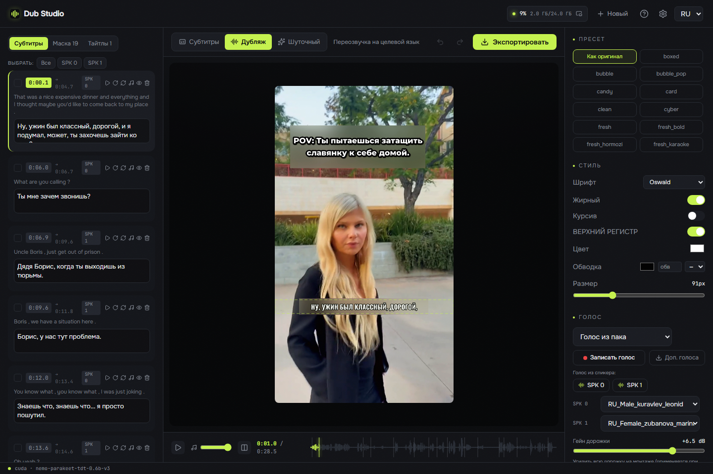
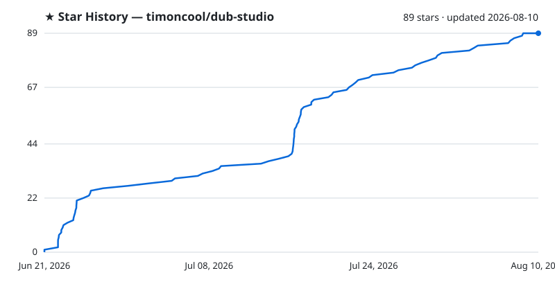

<div align="center">


# Dub Studio

**Нативная нейросеть-студия дубляжа видео на Windows — переозвучивает любой ролик с клоном голоса, переводом и локализацией вшитого текста, полностью офлайн. Ноль Python: один `.exe` на Rust + C++, всё остальное качается кнопкой.**

[](LICENSE)
[](https://github.com/timoncool/dub-studio/stargazers)
[](https://github.com/timoncool/dub-studio/commits)
[](https://github.com/timoncool/dub-studio/releases)
[](https://github.com/timoncool/dub-studio/releases)



**Русский** · **[English](docs/README-en.md)**

</div>

## Что это

**Dub Studio** — портативная студия дубляжа для Windows: закидываешь короткий ролик, а на выходе получаешь его переозвучку на другом языке — **с сохранённым тембром голоса, переведёнными субтитрами и локализованным вшитым текстом на кадре**. Работает **100% локально**: ничего не уходит в облако, ни видео, ни голос. Умный авто-проход делает первый вариант сам, а дальше живой редактор отдаёт под правку **каждый субтитр, голос, блюр-бокс, шрифт и тайтл** с мгновенным превью.

Это **v2 — полностью нативный порт**. Прошлая версия тянула за собой embeddable-Python, torch, CUDA-wheel'ы и llama-cpp-python — сборка на гигабайты и хрупкая установка. Теперь весь пайплайн переписан на **Rust + нативные C++/CUDA-движки (GGUF/ONNX)**: один процесс, быстрый старт, низкое потребление VRAM, **ноль Python в рантайме**. Всё тяжёлое — модели, движки, CUDA/VC++-DLL, ffmpeg — приложение **скачивает и ставит само кнопкой** при первом запуске. Вручную нужен только драйвер NVIDIA.

## Возможности

- **Дубляж любого ролика с клоном голоса** — оригинальный тембр клонируется и говорит на новом языке (нативный движок [Higgs Audio v3](https://huggingface.co/bosonai), GGUF Q8_0). Авто-каст по спикерам или свой голос из пака
- **Диаризация спикеров** — кто и когда говорит (NVIDIA **Sortformer** v2, до 4 голосов), разный голос на каждого спикера
- **Перевод + vision-анализ стиля** — весь транскрипт переводится локально через **Gemma-4 12B** (QAT q4_0 GGUF, llama.cpp), а vision-проход разбирает раскладку кадра: стиль субтитров, тайтлы, бренды, зоны текста
- **SOTA вокал-сепарация** — **Mel-Band Roformer** (нативный BSRoformer.cpp на CUDA) отделяет голос от музыки: фон ролика **сохраняется**, клон цепляется за чистую речь
- **Локализация вшитого текста** — OCR детектит текст на кадре (**PP-OCR** ONNX), **блюрит оригинал** и печатает поверх локализованный титр в подобранном стиле — фича, которой нет ни у одного другого инструмента
- **26 пресетов субтитров** — karaoke / word-by-word / hormozi / neon и другие, отрисованные **на твоём кадре** (JASSUB поверх того же `.ass`, что уходит в ffmpeg-burn — WYSIWYG)
- **Живой редактор** — правь транскрипт, голоса, стиль субтитров, блюр-боксы, тайтлы; **превью 0.17 с/кадр**, каждая правка видна сразу
- **Умный dirty-regen** — при экспорте переозвучиваются и пересчитываются **только правленые сегменты**, а не весь ролик
- **Шуточный ремикс** — задай тему («как пират», «в стиле новостей») → модель переписывает весь скрипт → передубляж
- **Сравнение до/после** — оригинал и дубляж бок о бок
- **Автоскачка всего** — модели, движки, CUDA/VC++-рантайм, ffmpeg тянутся кнопкой при первом запуске, всё внутри папки приложения
- **6 языков дубляжа** — EN / RU / ZH / ES / PT / FR, авто-детект языка источника
- **Полностью портативная** — ничего не пишется в профиль пользователя, удалил папку — не осталось следа

## Системные требования

- **ОС:** Windows 10 / 11 (x64)
- **GPU:** NVIDIA с 8–16 ГБ VRAM
- **WebView2** — предустановлен в Windows 11 (в Windows 10 ставится автоматически)
- **Место на диске:** ~15 ГБ на модели, движки и рантайм (тянутся при первом запуске), + место под рабочие проекты

## Что нужно установить

**Вручную ставится только одно — свежий драйвер NVIDIA:**

- **Драйвер NVIDIA** — [nvidia.com/Download](https://www.nvidia.com/Download/index.aspx). Драйвер — единственное, что нельзя доставить DLL-кой: он ставится в систему и включает `nvcuda.dll`. Приложение определяет его наличие само.

**Всё остальное приложение скачает и предложит установить кнопками** — ставить CUDA Toolkit, Visual C++ Redistributable, ffmpeg или качать веса вручную больше не нужно:

- **Модели** — Higgs Audio v3 (TTS), Gemma-4 12B + vision (перевод), Parakeet-TDT (ASR), Sortformer (диаризация), Mel-Band Roformer (сепарация) — прямые файлы с Hugging Face.
- **Движки-сайдкары** — движок Higgs (`audiocpp_engine.dll`), llama.cpp (CUDA 13.3), BSRoformer.cpp, ONNX Runtime 1.24.2, ffmpeg (NVENC) — zip-релизы с GitHub.
- **CUDA runtime** (`cudart64_13` / `cublas64_13` / `cublasLt64_13`) — из официальных редистрибутивных [PyPI-wheel'ов NVIDIA](https://pypi.org/project/nvidia-cublas/) (редистрибуция разрешена [CUDA Toolkit EULA](https://docs.nvidia.com/cuda/eula/index.html), Attachment A).
- **VC++ runtime** и **OCR-модели** — идут **в комплекте** релиза рядом с `.exe`, ничего качать не надо.

При **первом запуске** открывается панель «Первый запуск» со списком компонентов и статусами ✓/! у каждого. Жмёшь «Скачать» — приложение фоном тянет недостающее с прогрессом и перепроверяет. Драйвер отсутствует — кнопка открывает страницу загрузки NVIDIA.

## Быстрый старт

1. **Скачать** портативную сборку из [Releases](https://github.com/timoncool/dub-studio/releases) и распаковать в любую папку (или поставить через `-setup.exe` / `.msi`).

2. **Запустить** `Dub Studio.exe`.

3. **В панели «Первый запуск»** нажать «Скачать всё» — приложение само тянет модели, движки и рантайм (~15 ГБ, один раз). Драйвера NVIDIA нет — кнопка откроет сайт.

4. **Закинуть видео**, выбрать язык перевода → авто-проход делает первый вариант дубляжа. Дальше правишь всё в редакторе и жмёшь «Экспорт».

> Всё качается и хранится **внутри папки приложения**. Модели, кэши и проекты никуда больше не попадают.

## Как это работает

`analyze()` — фиксированный первый проход: сепарация → ASR со словными таймингами → диаризация → контекстный перевод + vision (стиль субтитров / тайтлы / бренды) → OCR (раскладка / блюр-боксы). На выходе — редактируемый документ **Project**. Каждая правка это патч этого Project с превью ~0.17 с/кадр; экспорт пере-прогоняет **только загрязнённые стадии**.

**Стек:** нативная оболочка Tauri 2 (Rust) поднимает `dub-server` (axum) на локальном порту и открывает окно на SPA — React 19 + Vite + Tailwind + react-konva поверх JASSUB. Движки: Parakeet-TDT (ASR, ONNX) · Sortformer (диаризация) · Gemma-4-12B GGUF (перевод + vision, llama.cpp) · Higgs Audio v3 (TTS, `audiocpp_engine.dll`) · Mel-Band Roformer (сепарация, BSRoformer.cpp) · PP-OCR (ONNX) · ffmpeg/NVENC. **Ни одного Python-процесса в рантайме.**

### Сборка из исходников

```bash
git clone https://github.com/timoncool/dub-studio.git
cd dub-studio

# 1) SPA
cd frontend && npm install && npm run build && cd ..

# 2) нативный сервер (axum)
cargo build --release -p dub-server

# 3) десктоп-оболочка (Tauri)
cd desktop && npm install && npx tauri build
```

Требуется Node 20+, Rust (MSVC toolchain) и WebView2. Нативные движки (`audiocpp_engine.dll`, llama.cpp, BSRoformer.cpp, ONNX Runtime) пересобирать не нужно — приложение скачивает готовые.

## Другие портативные нейросети

| Проект | Описание |
|--------|----------|
| [Higgs Ultimate](https://github.com/timoncool/Higgs-Ultimate) | Нативный синтез и клонирование речи (Higgs Audio v3) |
| [ACE-Step Studio](https://github.com/timoncool/ACE-Step-Studio) | AI-студия музыки — песни, вокал, каверы, клипы |
| [Foundation Music Lab](https://github.com/timoncool/Foundation-Music-Lab) | Генерация музыки + редактор таймлайна |
| [Qwen3-TTS](https://github.com/timoncool/Qwen3-TTS_portable_rus) | Портативный TTS с клонированием голоса |
| [VibeVoice ASR](https://github.com/timoncool/VibeVoice_ASR_portable_ru) | Портативное распознавание речи |
| [SuperCaption Qwen3-VL](https://github.com/timoncool/SuperCaption_Qwen3-VL) | Портативное описание изображений |

## Авторы

- **Nerual Dreming** — [Telegram](https://t.me/nerual_dreming) | [neuro-cartel.com](https://neuro-cartel.com) | основатель [ArtGeneration.me](https://artgeneration.me)
- **Нейро-Софт** — [Telegram](https://t.me/neuroport) | портативные нейросети

## Благодарности

- **[Boson AI](https://huggingface.co/bosonai)** — модель Higgs Audio v3, и **[drbaph / Higgs-Audio-v3-Studio](https://huggingface.co/drbaph/Higgs-Audio-v3-Studio)** — GGUF-кванты и нативный движок `audiocpp_engine.dll`.
- **[NVIDIA Parakeet](https://huggingface.co/nvidia/parakeet-tdt-0.6b-v3)** и **[Sortformer](https://huggingface.co/nvidia)** — ASR и диаризация; ONNX-веса из [istupakov/parakeet-tdt-0.6b-v3-onnx](https://huggingface.co/istupakov/parakeet-tdt-0.6b-v3-onnx) и [altunenes/parakeet-rs](https://github.com/altunenes/parakeet-rs).
- **[Google](https://huggingface.co/google/gemma-4-12b-it-qat-q4_0-gguf)** — Gemma-4 12B QAT (перевод + vision), через [llama.cpp](https://github.com/ggml-org/llama.cpp).
- **[chenmozhijin / BSRoformer.cpp](https://github.com/chenmozhijin/BSRoformer.cpp)** и **[GaboxR67](https://huggingface.co/GaboxR67)** — нативный движок и модель Mel-Band Roformer.

## Поддержать автора

Я создаю опенсорс софт и занимаюсь исследованиями в области ИИ. Большая часть всего, что я делаю, находится в открытом доступе. Ваши пожертвования позволяют мне создавать и исследовать больше, не отвлекаясь на поиск еды для продолжения существования =)

**[Все способы поддержки](DONATE.md)** | **[dalink.to/nerual_dreming](https://dalink.to/nerual_dreming)** | **[boosty.to/neuro_art](https://boosty.to/neuro_art)**

- **BTC:** `1E7dHL22RpyhJGVpcvKdbyZgksSYkYeEBC`
- **ETH (ERC20):** `0xb5db65adf478983186d4897ba92fe2c25c594a0c`
- **USDT (TRC20):** `TQST9Lp2TjK6FiVkn4fwfGUee7NmkxEE7C`

## Star History

<a href="https://github.com/timoncool/dub-studio/stargazers">
 <picture>
   <source media="(prefers-color-scheme: dark)" srcset="docs/stars-dark.svg" />
   <source media="(prefers-color-scheme: light)" srcset="docs/stars-light.svg" />
   
 </picture>
</a>

## Лицензия

Код приложения — [MIT](LICENSE). Веса моделей сохраняют свои лицензии (Higgs Audio v3 — research/non-commercial Boson AI; Gemma — Gemma Terms; и т.д.) — аудит перед каждым релизом.
