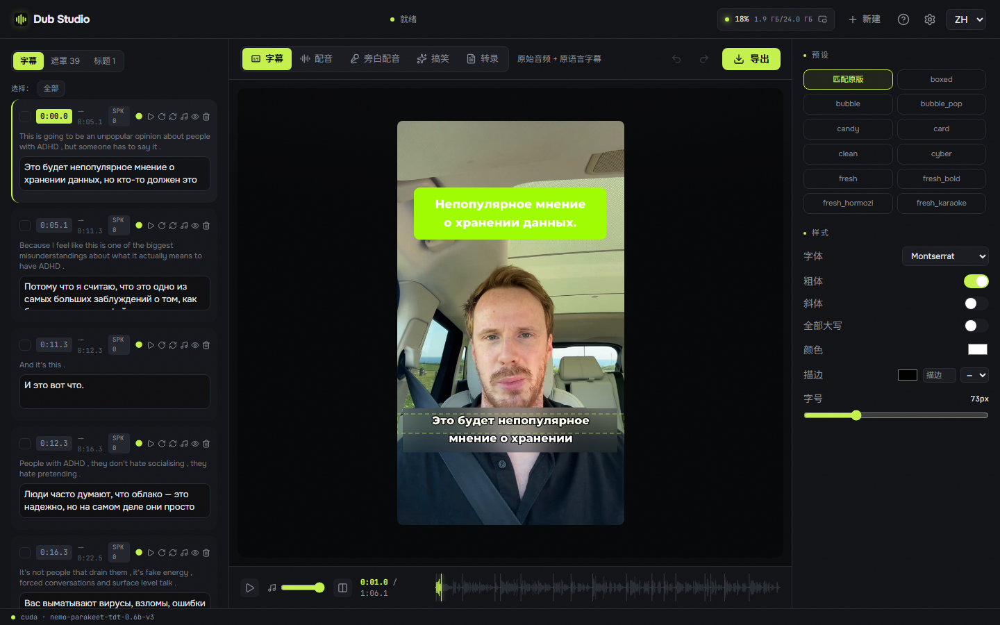
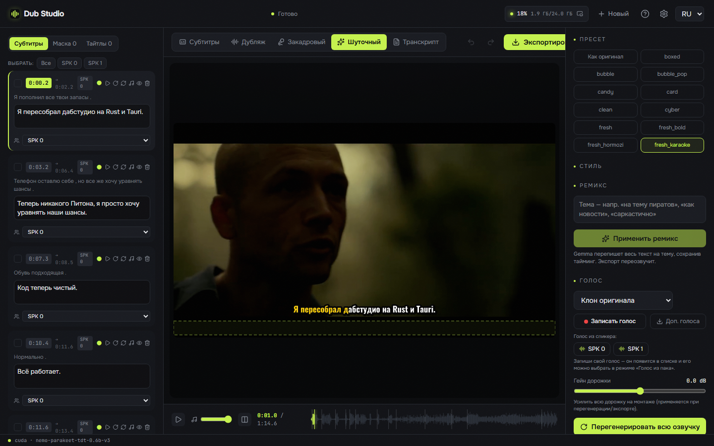
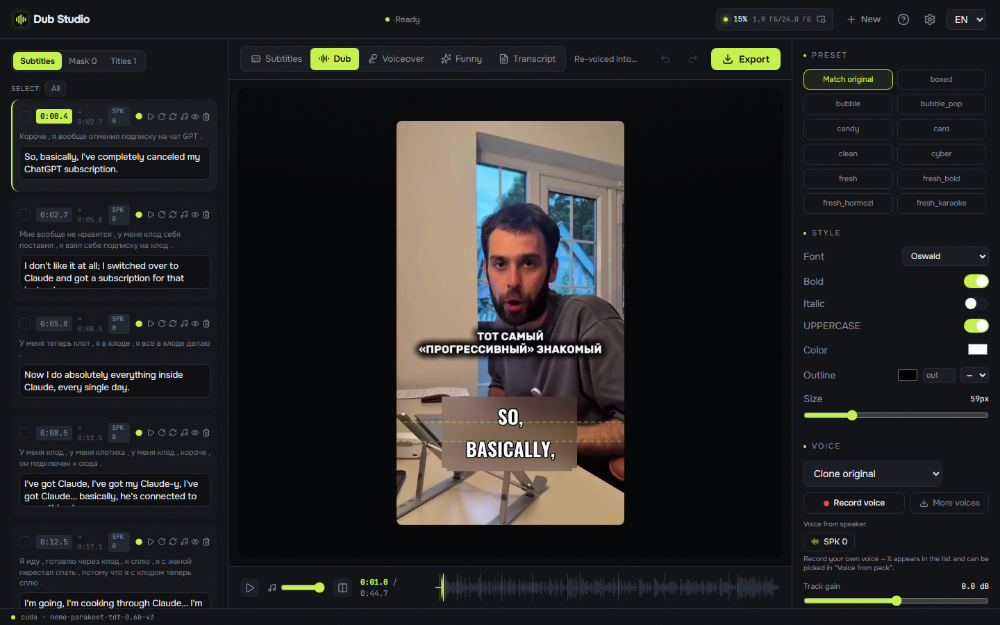

<div align="center">


# Dub Studio

**Free, offline AI video dubbing studio for Windows — re-voice any short video into another language with a cloned voice, translated captions, and on‑screen‑text localization. 100% local, zero Python: one native `.exe` (Rust + C++/CUDA); every model and engine downloads with a button.**

[](LICENSE)
[](https://github.com/timoncool/dub-studio/stargazers)
[](https://github.com/timoncool/dub-studio/releases)
[](https://github.com/timoncool/dub-studio/releases)
[](https://github.com/timoncool/dub-studio/commits)

**English** · [Русский](README.ru.md) · [中文](README.zh.md) · [Español](README.es.md) · [Português](README.pt.md) · [Français](README.fr.md)

### 🌐 [Live demo & before/after video showcase →](https://timoncool.github.io/dub-studio/)


</div>

## What it is

**Dub Studio** turns any short video into a dubbed version in another language — **with the speaker's own voice cloned, captions translated, and on‑screen text localized right on the frame**. Drop a clip, and a smart auto‑pass builds the first draft; then a live editor puts **every caption, voice, blur box, font and title** under your control with an instant preview.

Everything runs **100% on your machine** — no cloud, no upload, no subscription. Your footage and your voiceprint never leave your computer.

This is **v2 — a fully native rewrite**. No embeddable Python, no torch, no CUDA wheels. The whole pipeline is **Rust + native C++/CUDA engines (GGUF/ONNX)**: one process, fast startup, low VRAM. Models, engines, CUDA/VC++ runtime and ffmpeg are **downloaded and installed by the app itself** on first run — the only manual step is the NVIDIA driver.

## See it in action

**[▶ Watch the before/after video showcase →](https://timoncool.github.io/dub-studio/#showcase)** — real clips dubbed end‑to‑end on a local GPU: different videos, different modes, different languages, nothing left the machine.

|  |  |  |
|:--:|:--:|:--:|
| 🎙️ **Full dub** · EN→RU | 🗣️ **Voice-over** · EN→ES | 🎬 **Transcript** · diarized |
|  |  |  |
| 📝 **Subtitles** · original-lang | ✨ **Funny remix** · rewritten | 🎙️ **Reverse dub** · RU→EN |

## Five modes, switchable on the fly

| Mode | What it does |
|------|--------------|
| 🎙️ **Dub** | Full re-voice into the target language with the **original timbre cloned** — auto-cast per speaker or pick a voice |
| 🗣️ **Voice-over** | Translated voice **over the ducked original** — the source is still audible underneath; balance is adjustable |
| 📝 **Subtitles** | Burn **original-language** captions, keep the original audio — no dubbing, no translation |
| ✨ **Funny remix** | Give a theme ("as a pirate", "as a news report") → the model **rewrites the whole script**, then re-dubs |
| 🎬 **Transcript** | Clean **diarized transcript** with per-speaker layout, karaoke play-along, one-click voice creation, `.srt`/`.txt` export |

Load a clip once and send it into any mode — right inside the editor.

## Features

- **Voice cloning** — the original timbre is cloned and speaks the new language (native [Higgs Audio v3](https://huggingface.co/bosonai) engine, GGUF). Auto-cast by speaker or bring your own voice from a pack.
- **Speaker diarization** — who speaks and when (NVIDIA **Sortformer** v2, up to 4 voices), a distinct voice per speaker.
- **Choice of ASR engine** — transcribe with **Parakeet-TDT** (GPU, default) or **Whisper** ([Purfview faster-whisper standalone](https://github.com/Purfview/whisper-standalone-win), runs on CPU) — pick the model size (tiny … large-v3-turbo) and quant (compute type) right in settings.
- **Composable pipeline** — independent toggles at the input: audio (original / dub / voiceover / transcript) × subtitles (none / original / translated) × burn-in on/off × funny remix. Any combination — dub without subtitles, translated subtitles without dubbing, funny dub with your own voices — in batch and in the editor too.
- **On-screen text localization** — OCR detects baked-in text (**PP-OCR** ONNX), **blurs the original** and prints a localized title on top in a matched style — a feature no other tool has.
- **Translation + vision style analysis** — the transcript is translated locally with **Gemma-4 12B** (GGUF, llama.cpp); a vision pass reads the frame layout: caption style, titles, brands, text zones.
- **SOTA vocal separation** — **Mel-Band Roformer** (native BSRoformer.cpp on CUDA) splits voice from music, so the backing track is **preserved** and the clone latches onto clean speech.
- **26 caption presets** — karaoke / word-by-word / hormozi / neon and more, rendered **on your own frame** (WYSIWYG, JASSUB over the same `.ass` that ffmpeg burns).
- **Karaoke transcript** — play the video and follow along as the current line and the current **word** light up in the transcript.
- **Live editor** — edit transcript, voices, caption style, blur boxes, titles; **~0.17 s/frame preview**, every change visible instantly.
- **Smart re-gen** — export re-synthesizes and recomputes **only the segments you changed**, not the whole clip.
- **Batch processing** — a queue of files, all run with one setup, per-file progress.
- **Before/after compare** — original and dub side by side.
- **6 languages** — EN / RU / ZH / ES / PT / FR, with source-language auto-detect.
- **Any video format** — MP4, MOV, MKV, WEBM, AVI and more (decoded via ffmpeg).
- **One-button setup + in-app auto-update** — models, engines, CUDA/VC++ runtime and ffmpeg download on first run; the app updates itself.
- **Fully portable** — nothing is written to your user profile; delete the folder and no trace remains.

## Screenshots

Home — five modes, a preview of the selected video, language pickers, any video format:


Transcript mode — diarized transcript with per-speaker layout, karaoke play-along and one-click voice creation from each speaker:


## Requirements

- **OS:** Windows 10 / 11 (x64)
- **GPU:** NVIDIA with 8–16 GB VRAM
- **WebView2** — preinstalled on Windows 11 (installs automatically on Windows 10)
- **Disk:** ~15 GB for models, engines and runtime (fetched on first run), plus room for your projects

The only thing you install by hand is a recent **[NVIDIA driver](https://www.nvidia.com/Download/index.aspx)**. Everything else — models (Higgs Audio v3, Gemma-4 12B + vision, Parakeet-TDT, Sortformer, Mel-Band Roformer), engines, CUDA runtime and ffmpeg — the app downloads with a button on first run.

## Quick start

1. **Download** the portable build from [Releases](https://github.com/timoncool/dub-studio/releases) and unzip anywhere (or install via `-setup.exe` / `.msi`).
2. **Run** `Dub Studio.exe`.
3. On the **First-run** panel press **Download all** — the app fetches models, engines and runtime (~15 GB, once). If the NVIDIA driver is missing, the button opens the download page.
4. **Drop a video**, pick a target language → the auto-pass makes the first draft. Fine-tune everything in the editor and hit **Export**.

> Everything downloads and lives **inside the app folder**. Models, caches and projects go nowhere else.

## How it works

`analyze()` is a fixed first pass: separation → ASR with word timings → diarization → context translation + vision (caption style / titles / brands) → OCR (layout / blur boxes). The result is an editable **Project** document. Each edit is a patch on that Project with a ~0.17 s/frame preview; export re-runs **only the dirtied stages**.

**Stack:** a native **Tauri 2 (Rust)** shell spawns `dub-server` (axum) on a local port and opens a window onto the SPA — React 19 + Vite + Tailwind + react-konva over JASSUB. Engines: Parakeet-TDT or Whisper (ASR) · Sortformer (diarization) · Gemma-4-12B GGUF (translation + vision, llama.cpp) · Higgs Audio v3 (TTS) · Mel-Band Roformer (separation, BSRoformer.cpp) · PP-OCR (ONNX) · ffmpeg/NVENC. **Not a single Python process at runtime.**

### Build from source

```bash
git clone https://github.com/timoncool/dub-studio.git
cd dub-studio

cd frontend && npm install && npm run build && cd ..   # 1) SPA
cargo build --release -p dub-server                     # 2) native server (axum)
cd desktop && npm install && npx tauri build            # 3) desktop shell (Tauri)
```

Needs Node 20+, Rust (MSVC toolchain) and WebView2. Native engines (`audiocpp_engine.dll`, llama.cpp, BSRoformer.cpp, ONNX Runtime) don't need rebuilding — the app downloads prebuilt binaries.

## More portable AI apps

| Project | What it is |
|--------|----------|
| [Higgs Ultimate](https://github.com/timoncool/Higgs-Ultimate) | Native speech synthesis & voice cloning (Higgs Audio v3) |
| [ACE-Step Studio](https://github.com/timoncool/ACE-Step-Studio) | AI music studio — songs, vocals, covers, clips |
| [Foundation Music Lab](https://github.com/timoncool/Foundation-Music-Lab) | Music generation + timeline editor |
| [Qwen3-TTS](https://github.com/timoncool/Qwen3-TTS_portable_rus) | Portable TTS with voice cloning |
| [VibeVoice ASR](https://github.com/timoncool/VibeVoice_ASR_portable_ru) | Portable speech recognition |
| [SuperCaption Qwen3-VL](https://github.com/timoncool/SuperCaption_Qwen3-VL) | Portable image captioning |

## Authors

- **Nerual Dreming** — [Telegram](https://t.me/nerual_dreming) | [neuro-cartel.com](https://neuro-cartel.com) | founder of [ArtGeneration.me](https://artgeneration.me)
- **Neuro-Soft** — [Telegram](https://t.me/neuroport) | portable AI apps

## Credits

- **[Boson AI](https://huggingface.co/bosonai)** — the Higgs Audio v3 model, and **[drbaph / Higgs-Audio-v3-Studio](https://huggingface.co/drbaph/Higgs-Audio-v3-Studio)** — GGUF quants and the native `audiocpp_engine.dll`.
- **[NVIDIA Parakeet](https://huggingface.co/nvidia/parakeet-tdt-0.6b-v3)** and **[Sortformer](https://huggingface.co/nvidia)** — ASR and diarization; ONNX weights from [istupakov/parakeet-tdt-0.6b-v3-onnx](https://huggingface.co/istupakov/parakeet-tdt-0.6b-v3-onnx) and [altunenes/parakeet-rs](https://github.com/altunenes/parakeet-rs).
- **[Google Gemma](https://huggingface.co/google/gemma-4-12b-it-qat-q4_0-gguf)** — Gemma-4 12B (translation + vision), via [llama.cpp](https://github.com/ggml-org/llama.cpp).
- **[chenmozhijin / BSRoformer.cpp](https://github.com/chenmozhijin/BSRoformer.cpp)** and **[GaboxR67](https://huggingface.co/GaboxR67)** — the native engine and Mel-Band Roformer model.

## Support the author

I build open-source software and do AI research — most of what I make is freely available. Donations let me build and research more.

**[All the ways to support](DONATE.md)** | **[dalink.to/nerual_dreming](https://dalink.to/nerual_dreming)** | **[boosty.to/neuro_art](https://boosty.to/neuro_art)**

- **BTC:** `1E7dHL22RpyhJGVpcvKdbyZgksSYkYeEBC`
- **ETH (ERC20):** `0xb5db65adf478983186d4897ba92fe2c25c594a0c`
- **USDT (TRC20):** `TQST9Lp2TjK6FiVkn4fwfGUee7NmkxEE7C`

## Star history

<a href="https://github.com/timoncool/dub-studio/stargazers">
 <picture>
   <source media="(prefers-color-scheme: dark)" srcset="docs/stars-dark.svg" />
   <source media="(prefers-color-scheme: light)" srcset="docs/stars-light.svg" />
   
 </picture>
</a>

## License

App code is [MIT](LICENSE). Model weights keep their own licenses (Higgs Audio v3 — Boson AI research/non-commercial; Gemma — Gemma Terms; etc.) — audited before every release.

<sub>AI video dubbing · voice cloning · video translation · automatic subtitles · speaker diarization · offline · local · open source · Windows · free lip-free dubbing · voice-over · transcription</sub>
