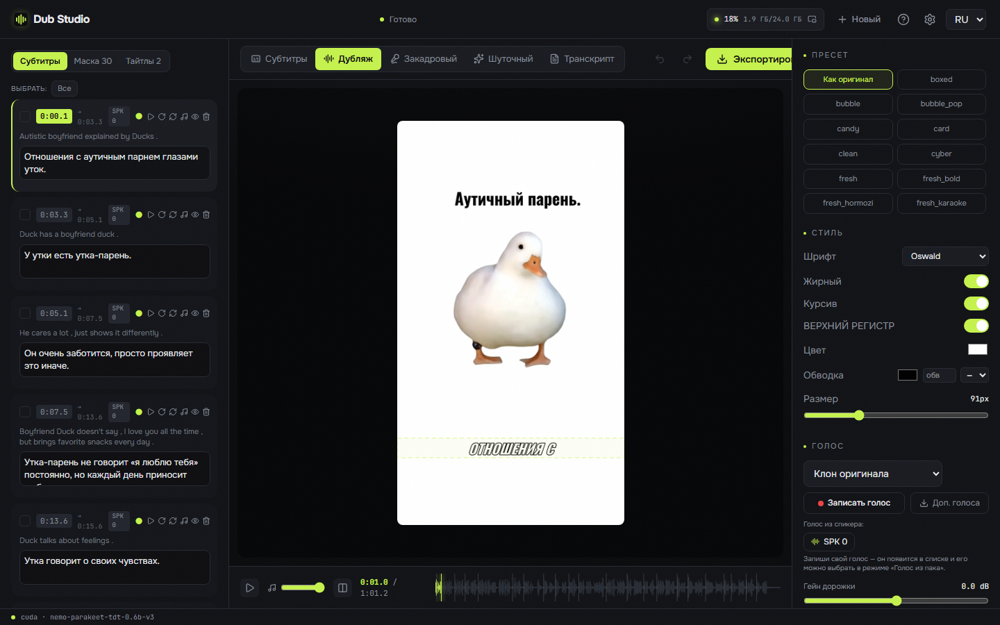
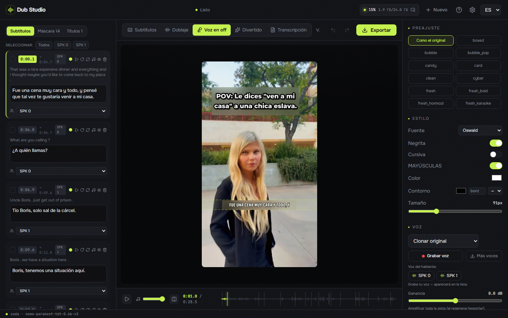
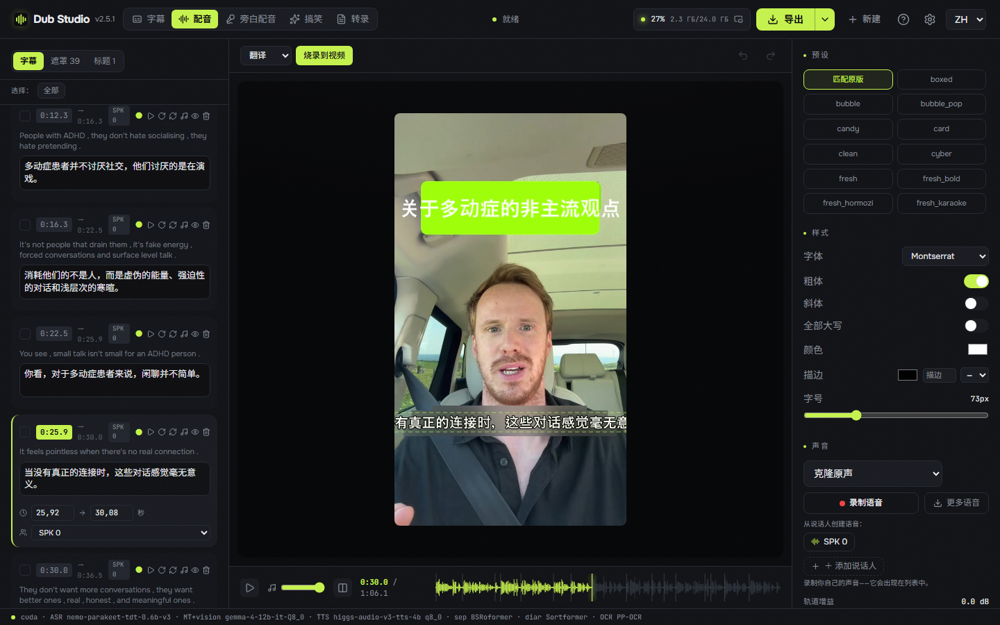
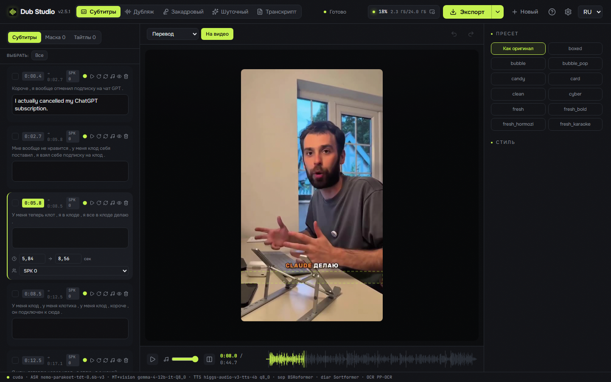
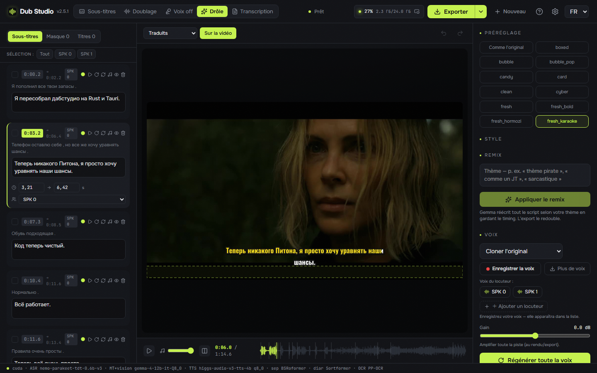
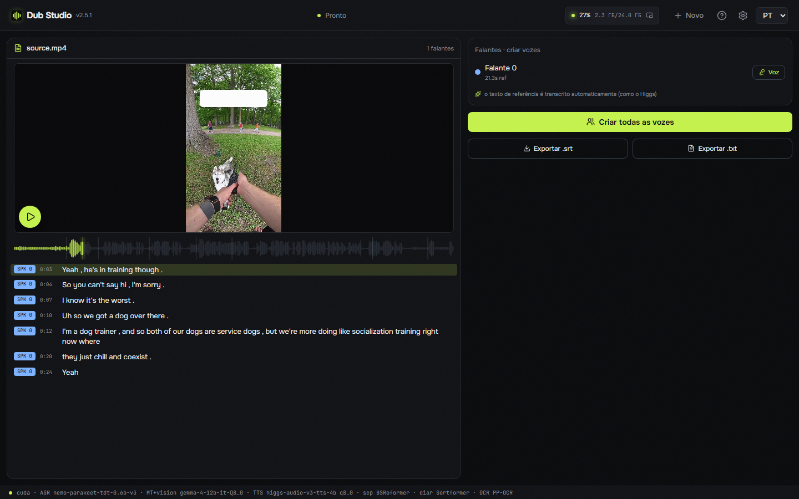
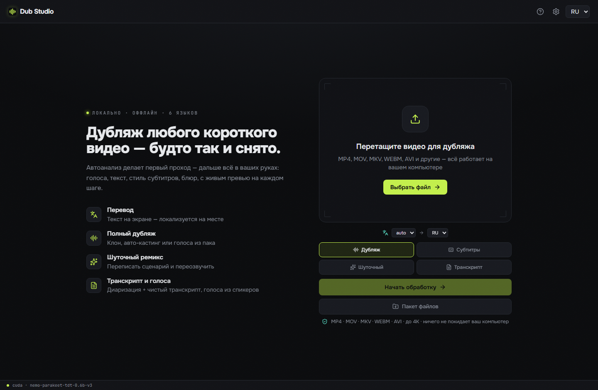
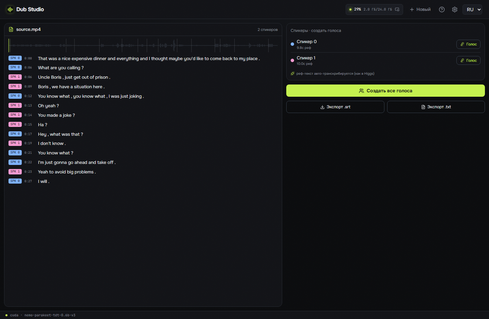

<div align="center">


# Dub Studio

**Бесплатная офлайн ИИ-студия дубляжа видео для Windows — переозвучивает любой ролик на другой язык с клоном голоса, переведёнными субтитрами и локализацией вшитого текста. 100% локально, ноль Python: один нативный `.exe` (Rust + C++/CUDA); все модели и движки качаются кнопкой.**

[](LICENSE)
[](https://github.com/timoncool/dub-studio/stargazers)
[](https://github.com/timoncool/dub-studio/releases)
[](https://github.com/timoncool/dub-studio/releases)

[English](README.md) · **Русский** · [中文](README.zh.md) · [Español](README.es.md) · [Português](README.pt.md) · [Français](README.fr.md)

### [🌐 Живое демо и showcase «до/после» →](https://timoncool.github.io/dub-studio/)



</div>

## Как это выглядит

**[▶ Смотреть showcase «до/после» на сайте →](https://timoncool.github.io/dub-studio/#showcase)** — реальные ролики, продублированные локально на GPU: разные видео, режимы и языки.

|  |  |  |
|:--:|:--:|:--:|
| 🎙️ **Дубляж** · EN→RU | 🗣️ **Закадровый** · EN→ES | 🈶 **Дубляж** · →中文 на кадре |
|  |  |  |
| 📝 **Субтитры** · язык оригинала | 🎬 **Дубляж** · широкий 16:9 | 🔤 **Транскрипт** · диаризация |

## Что это

**Dub Studio** превращает любой ролик в дубляж на другом языке — **с клонированным тембром спикера, переведёнными субтитрами и локализованным вшитым текстом прямо на кадре**. Закидываешь клип — умный авто-проход делает первый вариант; дальше живой редактор отдаёт под правку **каждый субтитр, голос, блюр-бокс, шрифт и тайтл** с мгновенным превью.

По умолчанию всё работает **локально на твоём компьютере** — без облака, без подписки: ни видео, ни голос никуда не уходят. А если ПК слабый (не тянет локальную Gemma/Higgs) или нужна скорость и качество — тяжёлые части (перевод, vision, озвучку, распознавание) можно **опционально** вынести в облако через **OpenRouter**: каждый движок выбирается отдельно (локально ↔ облако), голоса кастятся автоматически по полу спикера (бета). Ключ хранится локально, всё выключено по умолчанию.

Это **полностью нативный порт**. Ни embeddable-Python, ни torch, ни CUDA-wheel'ов. Весь пайплайн — **Rust + нативные C++/CUDA-движки (GGUF/ONNX)**: один процесс, быстрый старт, низкое потребление VRAM. Модели, движки, CUDA/VC++-рантайм и ffmpeg приложение **скачивает и ставит само** при первом запуске. **NVIDIA рекомендуется, но не обязательна** — у сепарации есть CPU-сборка, диаризация и распознавание идут на CPU, а тяжёлое (перевод, vision, озвучка) выносится в облако, так что дубляж собирается и на машине вовсе без NVIDIA.

## Пять режимов, переключаемых на лету

| Режим | Что делает |
|-------|------------|
| 🎙️ **Дубляж** | Полная переозвучка на целевой язык с **клоном оригинального тембра** — авто-каст по спикерам или свой голос |
| 🗣️ **Закадровый** | Перевод **поверх приглушённого оригинала** — исходник слышно снизу; баланс регулируется |
| 📝 **Субтитры** | Субтитры **на языке оригинала**, оригинальный звук сохранён — без дубляжа и перевода |
| ✨ **Шуточный ремикс** | Задай тему («как пират», «как новости») → модель **переписывает весь скрипт** и переозвучивает |
| 🎬 **Транскрипт** | Чистый **диаризованный транскрипт** с раскладкой по спикерам, караоке-плей, создание голосов в один клик, экспорт `.srt`/`.txt` |

Загрузил ролик один раз — и отправляешь в любой режим прямо в редакторе.

## Возможности

- **Клонирование голоса** — оригинальный тембр клонируется и говорит на новом языке (нативный движок [Higgs Audio v3](https://huggingface.co/bosonai), GGUF). Авто-каст по спикерам или свой голос из пака.
- **Диаризация спикеров** — кто и когда говорит (NVIDIA **Sortformer** v2, до 4 голосов), разный голос на каждого.
- **Кастинг персонажей (бета)** — персонаж это **связка «лицо + голос»**. Приложение собирает лица по всему видео, узнаёт одного и того же человека и **привязывает его к спикеру по со-встречаемости** реплик (кто в кадре крупным планом — получает голос, фоновый слушатель — нет); автоматически подбирает самый чёткий кадр-аватар и **сохраняет профиль кастинга на весь сериал** — назначил голоса и описания один раз, на **новой серии всё применяется само**. Тумблер **«Реальные лица / Мультфильм·аниме»** переключает распознавание лиц под тип контента.
- **Выбор ASR-движка** — транскрипция через **Parakeet-TDT** (GPU, по умолчанию) или **Whisper** ([standalone faster-whisper от Purfview](https://github.com/Purfview/whisper-standalone-win), работает на CPU) — размер модели (tiny … large-v3-turbo) и квант (compute type) выбираются прямо в настройках.
- **Импорт готовых субтитров** — загрузи свой `.srt`/`.ass` как готовый транскрипт: текст и тайминг берутся прямо из файла вместо авто-распознавания (спикеров всё равно раздаёт диаризация). Галочка **«субтитры уже на языке перевода»** пропускает и перевод — англ. ролик + твои русские сабы → русский дубляж напрямую из них, без ASR и без MT.
- **Мультиязычный экспорт** — стрелка **▾** у кнопки «Экспорт» отправляет одно видео сразу на несколько языков; каждый наследует все правки (раскладку субтитров, стили, блюр-боксы, клон голоса) — меняются только перевод и озвучка.
- **Сохранение и открытие проектов** — автосейв, список недавних проектов на старте, возврат к незаконченному в один клик.
- **Поиск в списках голосов и языков** — печатаешь часть имени, список сотен голосов или 100+ языков сужается; языки ищутся и по названию на языке интерфейса.
- **Композируемый пайплайн** — независимые тумблеры на входе: аудио (оригинал / дубляж / закадровый / транскрипт) × субтитры (нет / оригинал / перевод) × вжигать на видео × шуточный ремикс. Любые сочетания — дубляж без субтитров, перевод субтитров без дубляжа, шуточный дубляж своими голосами — в пакете и в редакторе тоже.
- **Локализация вшитого текста** — OCR детектит текст на кадре (**PP-OCR** ONNX), **блюрит оригинал** и печатает поверх локализованный титр в подобранном стиле — фича, которой нет ни у одного другого инструмента.
- **Перевод + vision-анализ стиля** — весь транскрипт переводится локально через **Gemma-4 12B** (GGUF, llama.cpp); vision-проход разбирает раскладку кадра: стиль субтитров, тайтлы, бренды, зоны текста.
- **SOTA вокал-сепарация** — **Mel-Band Roformer** (нативный BSRoformer.cpp на CUDA) отделяет голос от музыки: фон **сохраняется**, клон цепляется за чистую речь.
- **26 пресетов субтитров** — karaoke / word-by-word / hormozi / neon и другие, отрисованные **на твоём кадре** (WYSIWYG, JASSUB поверх того же `.ass`, что уходит в ffmpeg-burn).
- **Караоке-транскрипт** — воспроизводишь видео, а в транскрипте подсвечивается текущая строка и текущее **слово**.
- **Живой редактор** — правь транскрипт, голоса, стиль субтитров, блюр-боксы, тайтлы; **превью ~0.17 с/кадр**, каждая правка видна сразу.
- **Умный ре-ген** — при экспорте пересчитываются **только правленые сегменты**, а не весь ролик.
- **Свои реплики** — добавляй в транскрипт собственные фразы; каждая озвучивается склонированным голосом спикера и попадает в субтитры.
- **Пакетная обработка** — очередь файлов, все одними настройками, прогресс по каждому.
- **Сравнение до/после** — оригинал и дубляж бок о бок.
- **100+ языков** — дубляж на любой крупный язык (испанский, китайский, японский, арабский, хинди и другие), авто-детект языка источника.
- **Любые видео-форматы** — MP4, MOV, MKV, WEBM, AVI и другие (декод через ffmpeg).
- **Установка в одну кнопку + авто-обновление** — модели, движки, CUDA/VC++-рантайм и ffmpeg тянутся при первом запуске; приложение обновляет себя само.
- **Устойчивая докачка** — большие модели (10 ГБ+) при обрыве связи докачиваются с места, а не заново.
- **Считай где хочешь** — сепарация, диаризация и ASR по отдельности переключаются между **GPU, CPU и облаком**; сочетай как угодно. С выносом тяжёлых моделей (перевод, vision, озвучка) в **OpenRouter** весь пайплайн работает даже на машине **без NVIDIA**.
- **Настройка под железо** — у каждого движка несколько квантов (TTS Q8/Q6/Q4, перевод Q4…Q8, ASR int8/fp32 или Whisper tiny…large-v3-turbo, сепарация Q8/Q5/Q4) — переключаются в настройках; лимиты prefill-батча и длины реф-клипа под 8–12 ГБ GPU и 32 ГБ RAM.
- **Полностью портативная** — ничего не пишется в профиль пользователя; удалил папку — не осталось следа.

## Скриншоты

Главный экран — пять режимов, превью выбранного видео, выбор языков, любые видео-форматы:



Режим «Транскрипт» — диаризованный транскрипт с раскладкой по спикерам, караоке-плеем и созданием голосов из каждого спикера в один клик:



## Требования

- **ОС:** Windows 10 / 11 (x64)
- **GPU:** NVIDIA с 8–16 ГБ VRAM рекомендуется — **или без неё**: сепарация, диаризация и ASR идут на CPU, а тяжёлые модели — в облако
- **WebView2** — предустановлен в Windows 11 (в Windows 10 ставится автоматически)
- **Диск:** ~15 ГБ на модели, движки и рантайм (тянутся при первом запуске) + место под проекты

На машине с NVIDIA вручную ставится только свежий **[драйвер NVIDIA](https://www.nvidia.com/Download/index.aspx)**. Всё остальное — модели (Higgs Audio v3, Gemma-4 12B + vision, Parakeet-TDT, Sortformer, Mel-Band Roformer), движки, CUDA-рантайм и ffmpeg — приложение скачивает кнопкой при первом запуске.

## Быстрый старт

1. **Скачай** портативную сборку из [Releases](https://github.com/timoncool/dub-studio/releases) и распакуй в любую папку (или поставь через `-setup.exe` / `.msi`).
2. **Запусти** `Dub Studio.exe`.
3. В панели **«Первый запуск»** нажми **«Скачать всё»** — приложение тянет модели, движки и рантайм (~15 ГБ, один раз). Нет драйвера NVIDIA — кнопка откроет сайт.
4. **Закинь видео**, выбери язык перевода → авто-проход делает первый вариант. Дальше правишь всё в редакторе и жмёшь **«Экспорт»**.

> Всё качается и хранится **внутри папки приложения**. Модели, кэши и проекты никуда больше не попадают.

## Как это работает

`analyze()` — фиксированный первый проход: сепарация → ASR со словными таймингами → диаризация → контекстный перевод + vision (стиль субтитров / тайтлы / бренды) → OCR (раскладка / блюр-боксы). На выходе — редактируемый документ **Project**. Каждая правка это патч Project с превью ~0.17 с/кадр; экспорт пере-прогоняет **только загрязнённые стадии**.

**Стек:** нативная оболочка **Tauri 2 (Rust)** поднимает `dub-server` (axum) на локальном порту и открывает окно на SPA — React 19 + Vite + Tailwind + react-konva поверх JASSUB. Движки: Parakeet-TDT или Whisper (ASR) · Sortformer (диаризация) · Gemma-4-12B GGUF (перевод + vision, llama.cpp) · Higgs Audio v3 (TTS) · Mel-Band Roformer (сепарация, BSRoformer.cpp) · PP-OCR (ONNX) · ffmpeg/NVENC. **Ни одного Python-процесса в рантайме.**

### Сборка из исходников

```bash
git clone https://github.com/timoncool/dub-studio.git
cd dub-studio

cd frontend && npm install && npm run build && cd ..   # 1) SPA
cargo build --release -p dub-server                     # 2) нативный сервер (axum)
cd desktop && npm install && npx tauri build            # 3) десктоп-оболочка (Tauri)
```

Требуется Node 20+, Rust (MSVC toolchain) и WebView2. Нативные движки пересобирать не нужно — приложение качает готовые.

## Другие портативные нейросети

| Проект | Описание |
|--------|----------|
| [Higgs Ultimate](https://github.com/timoncool/Higgs-Ultimate) | Нативный синтез и клонирование речи (Higgs Audio v3) |
| [ACE-Step Studio](https://github.com/timoncool/ACE-Step-Studio) | AI-студия музыки — песни, вокал, каверы, клипы |
| [Foundation Music Lab](https://github.com/timoncool/Foundation-Music-Lab) | Генерация музыки + редактор таймлайна |
| [Qwen3-TTS](https://github.com/timoncool/Qwen3-TTS_portable_rus) | Портативный TTS с клонированием голоса |
| [VibeVoice ASR](https://github.com/timoncool/VibeVoice_ASR_portable_ru) | Портативное распознавание речи |
| [SuperCaption Qwen3-VL](https://github.com/timoncool/SuperCaption_Qwen3-VL) | Портативное описание изображений |

## Контрибьюторы и форки

**Коллабораторам всегда рады.** Я был бы искренне рад увидеть форки Dub Studio на другие платформы и видеокарты — архитектура это позволяет, у меня просто нет сил заниматься портами самому. Хочешь запустить его на **AMD / Intel GPU, macOS или Linux** — форкай и вперёд, PR приветствуются.

**Дополнительные локализации** тоже приветствуются: сейчас приложение и лендинг на 6 языках — переведи файлы локалей (`frontend/src/locales/` и словарь в `docs/index.html`) и открой PR со своим языком.

## Авторы

- **Nerual Dreming** — [Telegram](https://t.me/nerual_dreming) | [neuro-cartel.com](https://neuro-cartel.com) | основатель [ArtGeneration.me](https://artgeneration.me)
- **Нейро-Софт** — [Telegram](https://t.me/neuroport) | портативные нейросети

## Благодарности

- **[Boson AI](https://huggingface.co/bosonai)** — модель Higgs Audio v3, и **[drbaph / Higgs-Audio-v3-Studio](https://huggingface.co/drbaph/Higgs-Audio-v3-Studio)** — GGUF-кванты и нативный движок `audiocpp_engine.dll`.
- **[NVIDIA Parakeet](https://huggingface.co/nvidia/parakeet-tdt-0.6b-v3)** и **[Sortformer](https://huggingface.co/nvidia)** — ASR и диаризация; ONNX-веса из [istupakov/parakeet-tdt-0.6b-v3-onnx](https://huggingface.co/istupakov/parakeet-tdt-0.6b-v3-onnx) и [altunenes/parakeet-rs](https://github.com/altunenes/parakeet-rs).
- **[Google Gemma](https://huggingface.co/google/gemma-4-12b-it-qat-q4_0-gguf)** — Gemma-4 12B (перевод + vision), через [llama.cpp](https://github.com/ggml-org/llama.cpp).
- **[chenmozhijin / BSRoformer.cpp](https://github.com/chenmozhijin/BSRoformer.cpp)** и **[GaboxR67](https://huggingface.co/GaboxR67)** — нативный движок и модель Mel-Band Roformer.

## Поддержать автора

Я создаю опенсорс-софт и занимаюсь ИИ-исследованиями — большая часть в открытом доступе. Пожертвования позволяют делать и исследовать больше.

**[Все способы поддержки](DONATE.md)** | **[dalink.to/nerual_dreming](https://dalink.to/nerual_dreming)** | **[boosty.to/neuro_art](https://boosty.to/neuro_art)**

- **BTC:** `1E7dHL22RpyhJGVpcvKdbyZgksSYkYeEBC`
- **ETH (ERC20):** `0xb5db65adf478983186d4897ba92fe2c25c594a0c`
- **USDT (TRC20):** `TQST9Lp2TjK6FiVkn4fwfGUee7NmkxEE7C`

## Лицензия

Код приложения — [MIT](LICENSE). Веса моделей сохраняют свои лицензии (Higgs Audio v3 — research/non-commercial Boson AI; Gemma — Gemma Terms; и т.д.) — аудит перед каждым релизом.
