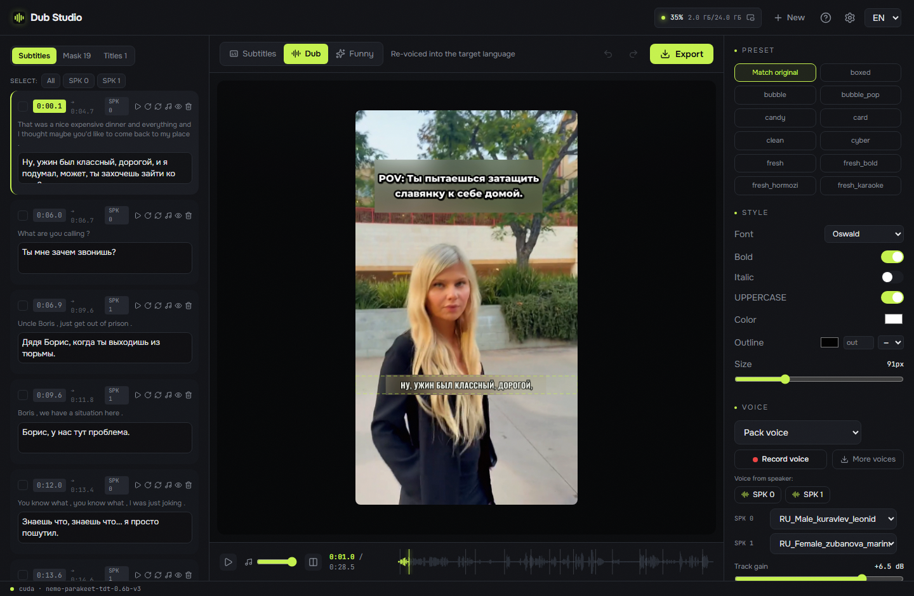
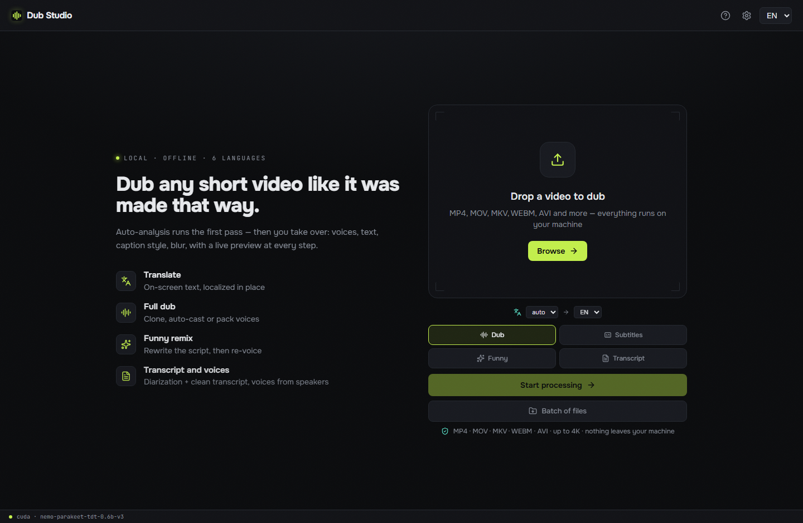
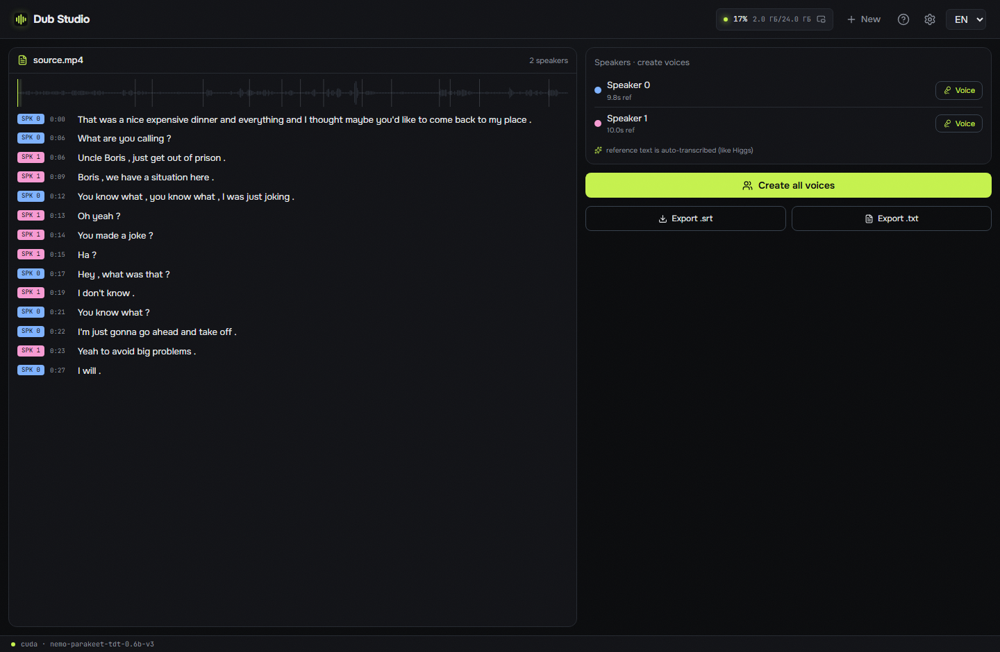

<div align="center">


# Dub Studio

**A native video-dubbing studio for Windows — re-voices any clip with a cloned voice, translation, and on-screen-text localization, fully offline. Zero Python: one `.exe` (Rust + C++); everything else downloads with a button.**

[](../LICENSE)
[](https://github.com/timoncool/dub-studio/stargazers)
[](https://github.com/timoncool/dub-studio/commits)
[](https://github.com/timoncool/dub-studio/releases)
[](https://github.com/timoncool/dub-studio/releases)



**[Русский](../README.md)** · **English**

</div>

## What it is

**Dub Studio** is a portable dubbing studio for Windows: drop in a short clip and get it re-voiced into another language — **with the original timbre cloned, translated captions, and localized on-screen text**. It runs **locally by default**: nothing leaves your machine, neither footage nor voiceprint — and the heavy stages (translation, vision, TTS, transcription) can **optionally** be offloaded to the cloud via **OpenRouter** (per-engine, for weak PCs or extra speed/quality; voices auto-cast by speaker gender, beta). A smart auto-pass produces the first draft; then a live editor puts **every caption, voice, blur box, font, and title** under your control with instant preview.

This is **v2 — a fully native rewrite**. The previous version dragged along an embeddable Python, torch, CUDA wheels, and llama-cpp-python — gigabytes of setup and a fragile install. Now the whole pipeline is rewritten in **Rust + native C++/CUDA engines (GGUF/ONNX)**: one process, fast startup, low VRAM, **zero Python at runtime**. Everything heavy — models, engines, CUDA/VC++ DLLs, ffmpeg — the app **downloads and installs itself with a button** on first run. The only manual step is the NVIDIA driver.

## What's new in this version

- **Transcript + diarization mode** — a new standalone screen: a clean transcript laid out by speaker + one-click voice creation from each speaker, export `.srt` / `.txt`
- **Speaker voices are cleaned and auto-transcribed** — the reference is run through vocal separation (no background/music) and gets reference text automatically, like Higgs → a better clone
- **A different voice per speaker** in pack mode — each diarized speaker is assigned its own voice
- **Reference text in the dubbing clone** — Higgs gets the transcript of the reference (auto-transcribed clip) → cleaner timbre
- **Blur backing sized exactly to the subtitle** — the original is hidden and the translation sits entirely on its own blurred plate (not half on clean video)
- **Master gain + volume** — boosting the whole track is visible right on the waveform; a separate preview-volume slider
- **Timeline ↔ transcript sync** — click a line to move the playhead; scrubbing highlights and scrolls the active line
- **Batch processing** — a queue of several files in one run
- **Any video format** — MP4, MOV, MKV, WEBM, AVI and more

## Features

- **Dub any clip with a cloned voice** — the original timbre is cloned and speaks the new language ([Higgs Audio v3](https://huggingface.co/bosonai) native engine, GGUF Q8_0). Auto-cast per speaker or pick a pack voice
- **Speaker diarization** — who speaks when (NVIDIA **Sortformer** v2, up to 4 voices), a different voice per speaker
- **Transcript + diarization mode** — a dedicated screen: audio/video → a clean transcript laid out by speaker (click a line to move the playhead and vice versa), and **one click turns each speaker into a voice** — the reference is cleaned by vocal separation and auto-transcribed into reference text (like Higgs). Export `.srt` / `.txt`
- **Translation + vision style analysis** — the whole transcript is translated locally by **Gemma-4 12B** (QAT q4_0 GGUF, llama.cpp), and a vision pass reads the frame layout: caption style, titles, brands, text zones
- **SOTA vocal separation** — **Mel-Band Roformer** (native BSRoformer.cpp on CUDA) splits voice from music: the clip's background is **preserved**, the clone locks onto clean speech
- **On-screen-text localization** — OCR detects text on the frame (**PP-OCR** ONNX), **blurs the original**, and prints a localized title on top in the matched style — a wedge no other tool owns
- **26 caption presets** — karaoke / word-by-word / hormozi / neon and more, rendered **on your frame** (JASSUB over the same `.ass` that goes to ffmpeg-burn — WYSIWYG)
- **Live editor** — edit transcript, voices, caption style, blur boxes, titles; **preview at 0.17 s/frame**, every edit visible at once
- **Smart dirty-regen** — export re-voices and recomputes **only the edited segments**, not the whole clip
- **Funny remix** — give a theme ("as a pirate", "as a news report") → the model rewrites the whole script → re-dub
- **Batch processing** — a queue of several files, each run with the same settings, per-file progress
- **Before / after** — original and dub side by side
- **Auto-download everything** — models, engines, CUDA/VC++ runtime, ffmpeg pulled with a button on first run, all inside the app folder
- **6 dubbing languages** — EN / RU / ZH / ES / PT / FR, source language auto-detected
- **Any video format** — MP4, MOV, MKV, WEBM, AVI and more (decoded via ffmpeg)
- **Fully portable** — nothing written to the user profile; delete the folder, no trace left

## Screenshots

Home — four modes (dub / subtitles / funny / transcript), language pickers, any video format accepted:



Transcript mode — a diarized transcript laid out by speaker, with clean voices created from each speaker in one click:



## System requirements

- **OS:** Windows 10 / 11 (x64)
- **GPU:** NVIDIA with 8–16 GB VRAM
- **WebView2** — preinstalled on Windows 11 (installs automatically on Windows 10)
- **Disk:** ~13 GB for models and engines (fetched on first run), plus space for project work dirs

## What you need to install

**The only manual step is a fresh NVIDIA driver:**

- **NVIDIA driver** — [nvidia.com/Download](https://www.nvidia.com/Download/index.aspx). The driver is the one thing that can't ship as a DLL: it installs into the system and provides `nvcuda.dll`. The app detects it for you.

**Everything else the app downloads and offers to install with buttons** — no more installing CUDA Toolkit, Visual C++ Redistributable, ffmpeg, or fetching weights by hand:

- **Models** — Higgs Audio v3 (TTS), Gemma-4 12B + vision (translation), Parakeet-TDT (ASR), Sortformer (diarization), Mel-Band Roformer (separation) — direct files from Hugging Face.
- **Sidecar engines** — the Higgs engine (`audiocpp_engine.dll`), llama.cpp (CUDA 13.3), BSRoformer.cpp, ONNX Runtime 1.24.2, ffmpeg (NVENC) — GitHub zip releases.
- **CUDA runtime** (`cudart64_13` / `cublas64_13` / `cublasLt64_13`) — from NVIDIA's official redistributable [PyPI wheels](https://pypi.org/project/nvidia-cublas/) (redistribution permitted by the [CUDA Toolkit EULA](https://docs.nvidia.com/cuda/eula/index.html), Attachment A).
- **VC++ runtime** and **OCR models** ship **bundled** next to the `.exe` — nothing to download.

On **first run** a "First run" panel lists the components with a ✓/! status each. Hit "Download" and the app fetches what's missing in the background with progress, then re-checks. If the driver is missing, the button opens NVIDIA's download page.

## Quick start

1. **Download** the portable build from [Releases](https://github.com/timoncool/dub-studio/releases) and unzip anywhere (or install via `-setup.exe` / `.msi`).

2. **Launch** `Dub Studio.exe`.

3. **In the "First run" panel** click "Download all" — the app fetches the models, engines, and runtime itself (~13 GB, once). No NVIDIA driver? The button opens the site.

4. **Drop a video**, pick the target language → the auto-pass makes the first dub draft. Then edit everything in the editor and hit "Export".

> Everything is downloaded and stored **inside the app folder**. Models, caches, and projects go nowhere else.

## How it works

`analyze()` is the fixed first stage: separate → ASR (word timings) → diarize → context-translate + vision (caption style / titles / brands) → OCR (layout / blur boxes). It returns an editable **Project** document. Every edit is a patch on that Project with a ~0.17 s/frame preview; export re-runs **only the dirtied stages**.

**Stack:** a native Tauri 2 shell (Rust) launches `dub-server` (axum) on a local port and opens a window onto the SPA — React 19 + Vite + Tailwind + react-konva over JASSUB. Engines: Parakeet-TDT (ASR, ONNX) · Sortformer (diarization) · Gemma-4-12B GGUF (translate + vision, llama.cpp) · Higgs Audio v3 (TTS, `audiocpp_engine.dll`) · Mel-Band Roformer (separation, BSRoformer.cpp) · PP-OCR (ONNX) · ffmpeg/NVENC. **Not a single Python process at runtime.**

### Build from source

```bash
git clone https://github.com/timoncool/dub-studio.git
cd dub-studio

# 1) SPA
cd frontend && npm install && npm run build && cd ..

# 2) native server (axum)
cargo build --release -p dub-server

# 3) desktop shell (Tauri)
cd desktop && npm install && npx tauri build
```

Requires Node 20+, Rust (MSVC toolchain) and WebView2. The native engines (`audiocpp_engine.dll`, llama.cpp, BSRoformer.cpp, ONNX Runtime) don't need rebuilding — the app downloads prebuilt ones.

## License

App code is [MIT](../LICENSE). Model weights keep their own licenses (Higgs Audio v3 — Boson AI research/non-commercial; Gemma — Gemma Terms; etc.) — audited before each release.
